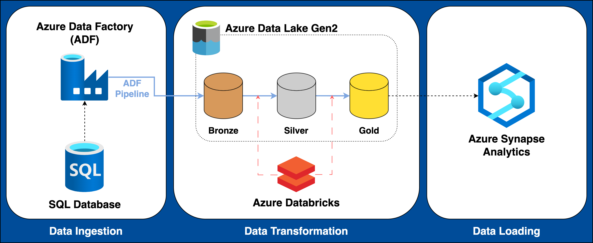

# Azure Data Engineering
The objective of this project is to utilize various resources within Azure to create a data engineering pipeline. The data was prepared within Azure Synapse Analytics to be loaded into a BI tool for data analysis.

## Project Archeticture

## Data Source
The data used in this project is AdventureWorks, which is provided within a sample database in Azure SQL Database.
